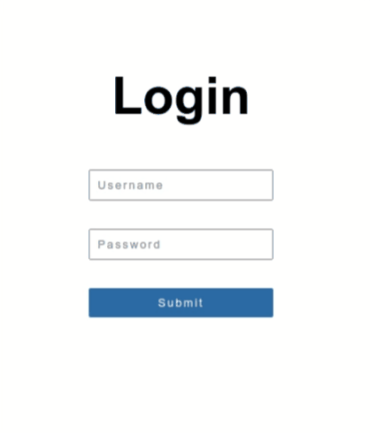

# Conditional navigation

### This exercise will help you to practice using **useNavigate** react hook.

## Instruction:

- As a first step, browse the existing files and get yourself familiar with the content before going further.
- Inside your `Login.js`, write the proper change/ submit handlers to achieve the following:

  - If the entered data matchs the once in the local state, the user should be directed to the home page. (use `useNavigate` hook)

  ```javascript
  const [data, setData] = useState({
    userName: "john doe",
    password: "r3@ct",
  });
  ```

  - If the credentials are incorrect, the user should get a warning message on the screen. (manipulate the visibility of the p `element`)

<br>

> You might want to create another state to save some values in order to do the check, or maybe use the same existing state.


